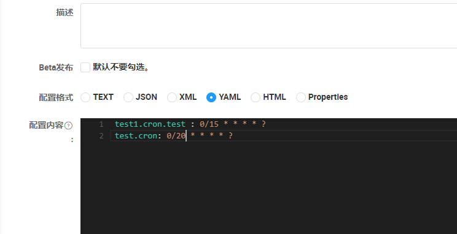
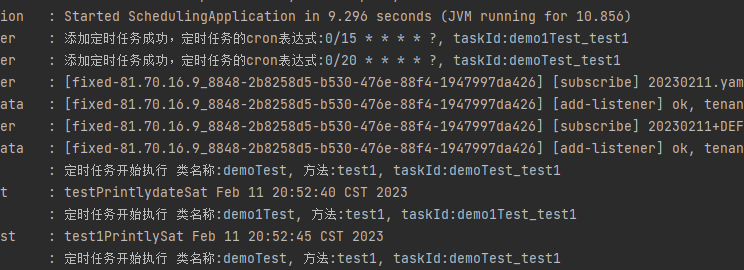
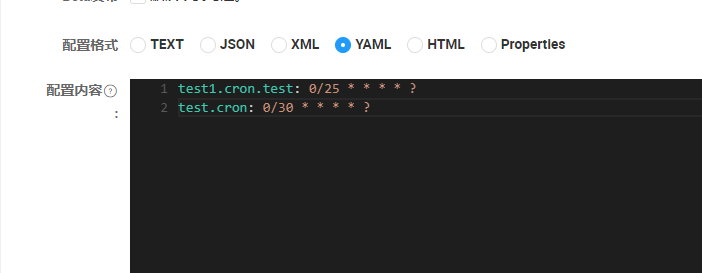
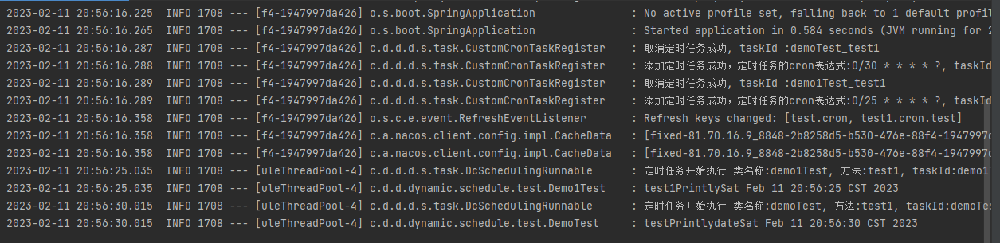

# 1，maven 官方仓库查找

## 1.1 复制maven 的坐标 

```
<dependency>
  <groupId>com.github.ducheng</groupId>
	<artifactId>dynamic-schedule-nacos-spring-boot-starter</artifactId>
	<version>0.0.1</version>
</dependency>
```


# 1.2 在springboot 的启动类加上

@EnableDistributedDynamicScheduling

```java
@SpringBootApplication
//开启分布式动态定时任务的注解
@EnableDistributedDynamicScheduling
public class SpringFastfdsApplication {

	public static void main(String[] args) {
		SpringApplication.run(SpringFastfdsApplication.class, args);
	}

}
```

# 1.3  使用案例

## 1.3.1  之前的springboot 整合Schedule 改怎么使用就怎么使用

## 1.3.2 代码片段

```java

@Component
public class Demo1Test {

    private static Log log = LogFactory.getLog(Demo1Test.class);

    @DynamicScheduled(cron = "${test1.cron.test}",desc = "test1")
    public void test1() {

        log.info("test1Printly"+new Date());
    }
}

@Component
public class DemoTest {

    private static Log log = LogFactory.getLog(DemoTest.class);

    @DynamicScheduled(cron = "${test.cron}",desc = "test")
    public void test1() {

        log.info("testPrintlydate"+new Date());
    }
}


```

```yaml
#bootstrap.yml 关于nacos的一些配置
spring:
  application:
    name: test
  cloud:
    nacos:
      discovery:
        server-addr: 127.0.0.1:8848
      config:
        server-addr: 127.0.0.1:8848
        namespace: dd02f7f8-99cf-4890-a16a-d889b259a8d6
        file-extension: yaml
```


```yaml
# application.yml redis 的配置和动态定时任务的配置
spring:
  redis:
    host: 127.0.0.1
    port: 6379
  cloud:
    nacos:
      config:
        distributed:
          dynamic:
            schedule-id: test0119
```


## 1.3.3  nacos 的配置





## 1.3.4  启动服务




1.3.5 修改nacos   观察日志



